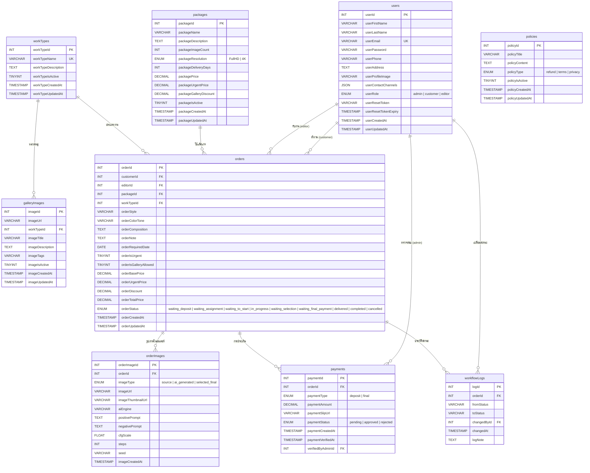
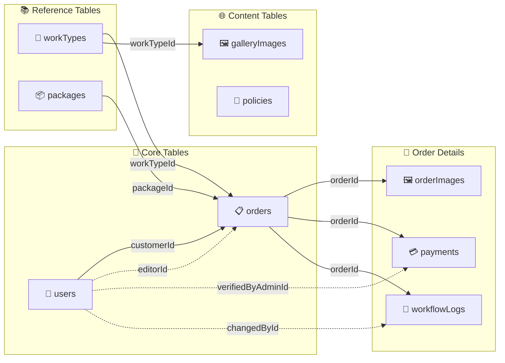
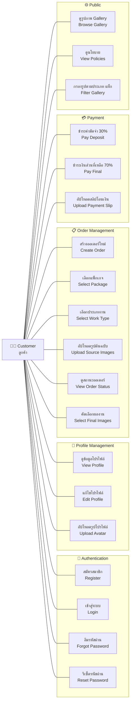
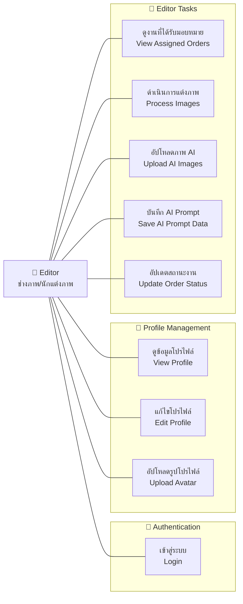
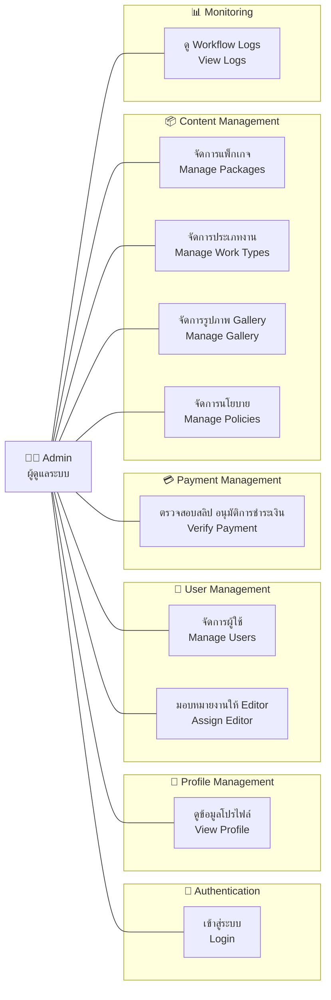
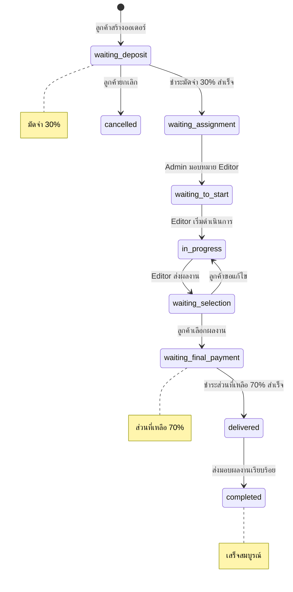

# COOS Database — ER Diagram & Use Case Diagram

เอกสารนี้แสดง Entity Relationship Diagram (ER Diagram) และ Use Case Diagram ของระบบ COOS
สร้างจากไฟล์ [database.sql](../backend/database.sql)

---

## 1. ER Diagram (Entity Relationship Diagram)

---

## 2. ER Diagram — เฉพาะความสัมพันธ์ (Simplified)

---

## 3. Use Case Diagrams

### 3.1 Use Case — Customer (ลูกค้า)

---

### 3.2 Use Case — Editor (ช่างภาพ/นักแต่งภาพ)

---

### 3.3 Use Case — Admin (ผู้ดูแลระบบ)

---

## 4. Order Status Flow (Workflow)

---

## 5. สรุปตาราง (Table Summary)

| # | ตาราง | จำนวนฟิลด์ | คำอธิบาย | ความสัมพันธ์ |
|---|-------|------------|----------|-------------|
| 1 | `users` | 13 | ผู้ใช้งานทั้ง 3 บทบาท (admin, customer, editor) | อ้างอิงโดย orders, payments, workflowLogs |
| 2 | `workTypes` | 6 | ประเภทงาน (Pre-wedding, Portrait, etc.) | อ้างอิงโดย orders, galleryImages |
| 3 | `packages` | 11 | แพ็กเกจบริการ (Basic, Standard, Pro) | อ้างอิงโดย orders |
| 4 | `galleryImages` | 9 | รูปภาพตัวอย่างผลงานใน Portfolio | FK → workTypes |
| 5 | `policies` | 7 | นโยบาย (refund, terms, privacy) | ไม่มี FK |
| 6 | `orders` | 18 | ออเดอร์งาน — ตารางหลัก | FK → users, packages, workTypes |
| 7 | `orderImages` | 11 | รูปภาพในออเดอร์ + ข้อมูล AI Prompt | FK → orders |
| 8 | `payments` | 8 | การชำระเงิน (มัดจำ + ส่วนที่เหลือ) | FK → orders, users |
| 9 | `workflowLogs` | 6 | ประวัติการเปลี่ยนสถานะออเดอร์ | FK → orders, users |

> **รวมทั้งหมด**: 9 ตาราง, 89 ฟิลด์, 10 Foreign Key relationships
